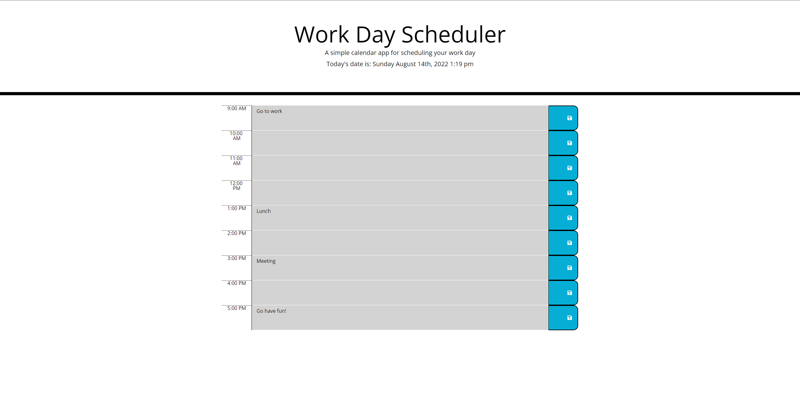

# Date Master

## Website

https://calebfunderburk.github.io/Date-Master/

## Built With

- HTML
- CSS
    - Bootstrap
- JavaScript
    - JQuery
    - MomentJS

## Project Narrative

### About

In this project, I was tasked with updating the current code I was given to make an app that allows users to add and save tasks they need to accomplish throughout the day. The tasks also needed to have a function where they change colors based on the time of day, to let users know what tasks should be completed or started soon. Most of what I did in this project required me to use JQuery for DOM maniplutaion, and MomentJS to track the current time of day. 

## Screenshot

